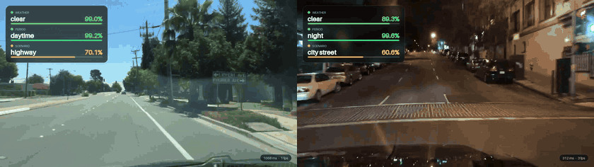

# BDD100K-Toolkit

[](https://github.com/dronefreak/bdd100k-toolkit/actions/workflows/ci.yml)
[](pyproject.toml)
[](https://pytorch.org/)
[](LICENSE)
[](https://github.com/dronefreak/bdd100k-toolkit/commits)
[](https://www.bdd100k.com/)
[](#classification-backends)
[](https://github.com/astral-sh/ruff)



Unofficial, modern, dependency-clean toolkit for [BDD100K](https://www.bdd100k.com/) tasks.
It currently covers the three image-attribute classification tasks (period,
weather, scenario). Further tasks will be added here once they are done and
verified on real data.

## Why this exists

The official [`bdd100k/bdd100k`](https://github.com/bdd100k/bdd100k) toolkit
has been unmaintained since early 2024 (no maintainer response on any open
issue since 2021), pins `pydantic<2.0.0` behind a hard, unpinned
`git+scalabel` dependency that **crashes its own `to_coco.py` under modern
pydantic** ([bdd100k/bdd100k#354](https://github.com/bdd100k/bdd100k/issues/354)),
has unfixed task gaps (e.g. `to_mask.py` not supporting `lane_mark` mode,
[bdd100k/bdd100k#317](https://github.com/bdd100k/bdd100k/issues/317)), and its
official download infrastructure (`bdd-data.berkeley.edu`, `doc.bdd100k.com`,
even the ETH mirror) is largely unreachable as reported across a dozen open
issues. BDD100K the *dataset* is still widely used; the *tooling* is not.

This project starts small and depends only on modern, actively maintained
libraries (Hydra, Ultralytics, PyTorch, optionally timm), with no `scalabel`
and no pinned pydantic.

See [`VISION.md`](VISION.md) for the full rationale, architectural
philosophy, and task status, and [`ROADMAP.md`](ROADMAP.md) for the
granular checklist.

## Tasks

<details>
<summary><b>Classification</b> (period, weather, scenario)</summary>

| Task | Classes | Source |
|---|---|---|
| Time-of-day (period) classification, unofficial | 4 (daytime, night, dawn or dusk, unknown) | `attributes.timeofday` |
| Weather classification, unofficial | 7 (clear, partly cloudy, overcast, rainy, snowy, foggy, unknown) | `attributes.weather` |
| Scenario (scene) classification, unofficial | 7 (city street, highway, residential, parking lot, gas stations, tunnel, unknown) | `attributes.scene` |

These tasks are **unofficial**: BDD100K defines no classification benchmark,
only per-image `attributes: {weather, timeofday, scene}` in its detection label
JSON. The tasks follow three Kaggle datasets (`bdd100k-period-classification`,
`bdd100k-weather-classification`, `bdd100k-scenario-classification`, uploaded
by `marquis03`, Apache-2.0 on Kaggle). Checked image by image against the
official 2018 labels, those datasets are the same labels and the same images,
with `unknown` being the official `undefined` value and their `test` folder
being the official unlabeled test split (ignored here). `unknown` is kept as a
class by default (`--exclude-unknown` drops it).

The label distribution is heavily imbalanced (for example 13 `foggy` and 7
`gas stations` images in the test split), so evaluation reports per-class
precision, recall and F1 and the macro averages, not just top-1 accuracy. See
[`docs/data-notes.md`](docs/data-notes.md) for the real counts.

## Model Zoo

| Task | Model | Macro F1 | Top-1 | Balanced acc | Macro precision |
|---|---|---|---|---|---|
| Weather | [ConvNeXt-Atto](https://huggingface.co/dronefreak/bdd100k-weather-convnext_atto) | 67.44% | 83.00% | 65.25% | 81.38% |
| Period (time of day) | [EfficientViT-B0](https://huggingface.co/dronefreak/bdd100k-period-efficientvit_b0) | 80.98% | 93.71% | 77.14% | 86.44% |
| Scenario | [MobileNetV4-Conv-Small](https://huggingface.co/dronefreak/bdd100k-scenario-mobilenetv4_conv_small) | 52.89% | 78.20% | 48.69% | 61.41% |

## Data layout

Two input layouts are auto-detected under `--raw-dir`:

```text
# official BDD100K (images and labels are separate archives; use
# --labels-dir if the labels were extracted somewhere else)
raw_dir/
  images/100k/{train,val}/**/*.jpg
  labels/bdd100k_labels_images_{train,val}.json

# Kaggle class folders (test/ is unlabeled and ignored)
raw_dir/
  {train,val}/<class>/*.jpg
```

Both produce identical output (verified on the real data for all three
tasks). Official `val` becomes `test`; a seeded 15% of `train` becomes
`valid`. The holdout is chosen over the sorted names of all train images, so
it is the same for all three tasks and with or without `--exclude-unknown`.

Canonical output (plain `torchvision.datasets.ImageFolder` layout:
Ultralytics' classification trainer reads this directly, no glue needed):

```text
canonical_out/
  train/<class>/*.jpg
  valid/<class>/*.jpg
  test/<class>/*.jpg
```

## Quickstart

Three commands: `bdd100k-prepare`, `bdd100k-train` and `bdd100k-evaluate`. The
task is inferred from the dataset key (`--dataset` / `dataset=`), and running a
command with `--help` lists the available datasets.

```bash
pip install -e ".[dev]"

# 1. Convert a download into canonical weather-classification splits.
#    --raw-dir is either the official download or a Kaggle class-folder tree;
#    add --labels-dir if the label JSON lives outside <raw-dir>/labels, and
#    --exclude-unknown to drop the `unknown` class.
bdd100k-prepare --dataset bdd100k-weather \
    --raw-dir /path/to/bdd100k_raw --output-dir /path/to/canonical_out

# 2. Train (data_dir is required; no default)
bdd100k-train dataset=bdd100k-weather model.name=yolo11n-cls \
    dataset.data_dir=/path/to/canonical_out

# 3. Evaluate (top-1/top-5, per-class precision/recall/F1, macro F1, confusion matrix)
bdd100k-evaluate --dataset bdd100k-weather \
    --checkpoint experiments/bdd100k-weather/yolo11n-cls/yolo11n-cls/weights/best.pt \
    --data-dir /path/to/canonical_out
```

The same three commands work for `bdd100k-period` and `bdd100k-scenario`.

## Classification backends

Two backends train the classification tasks, chosen with `model.backend`:

| Backend | Models | Number of models | Install |
|---|---|---|---|
| `ultralytics` (default) | `yolo11n-cls`, `yolov8s-cls`, ... | 15 pretrained (`yolov8`, `yolo11`, `yolo26` in n/s/m/l/x) | included |
| `timm` | any of timm's architectures (`convnext_tiny`, `resnet50`, `efficientnet_b0`, ...) with pretrained weights | 1,351 architectures (1,807 pretrained weight sets) | `pip install "bdd100k-toolkit[timm]"` |

```bash
bdd100k-train dataset=bdd100k-weather model.backend=timm model.name=convnext_tiny \
    dataset.data_dir=/path/to/canonical_out
# timm options go through training.extra (a typo fails loudly):
#   +training.extra.balance=loss        class-weighted loss (or `sampler`)
#   +training.extra.balance_power=0.5   weights = count ** -power
#   +training.extra.label_smoothing=0.1 +training.extra.weight_decay=0.05
bdd100k-evaluate --dataset bdd100k-weather --checkpoint <run>/weights/best.pt \
    --data-dir /path/to/canonical_out   # the backend is detected from the file
```

Both backends are evaluated by the same report (per-class F1, macro F1,
confusion matrix).

</details>

## License

BSD-3-Clause for this toolkit's code. BDD100K's own data remains governed by
the [BDD100K License](https://www.bdd100k.com/) (non-commercial
research/education; registration-gated; no redistribution). This project
never redistributes BDD100K data itself.

## Roadmap

- [ ] Add scenario/weather/period classification datasets
  - [ ] Add demo support for images/videos
- [ ] Add object detection dataset support
  - [ ] Add demo support for images/videos
- [ ] Add semantic segmentation dataset support
  - [ ] Add demo support for images/videos
- [ ] Add object tracking support
  - [ ] Add demo support
- [ ] Add ONNX/TensorRT export mechanisms
